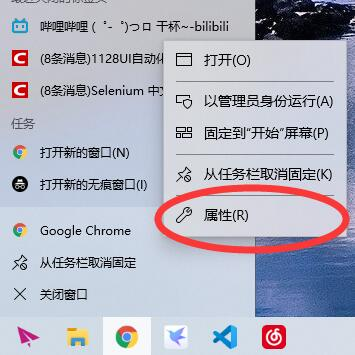
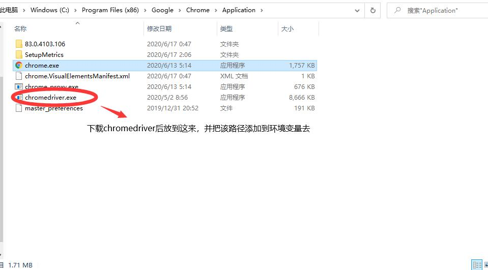
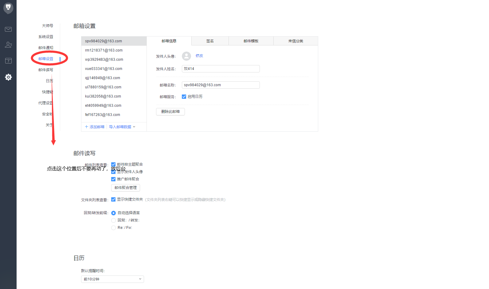
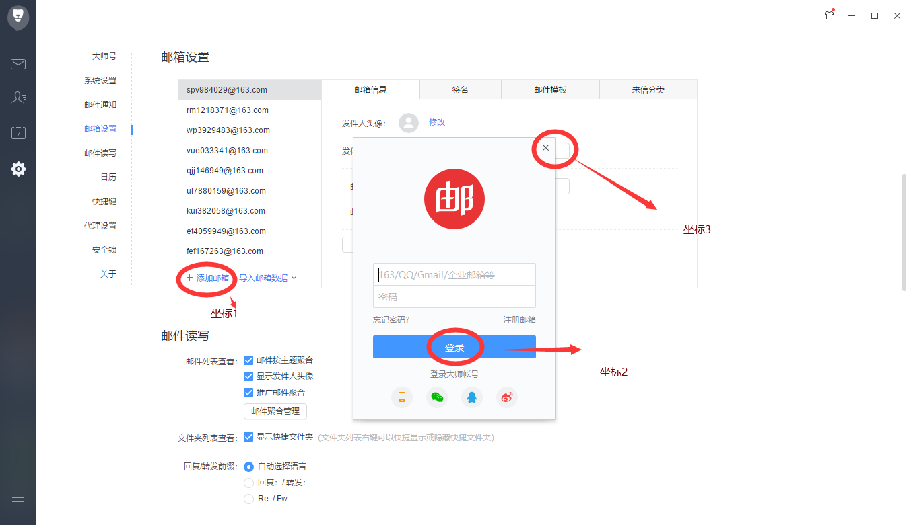

# 脚本说明

本脚本可以半自动地将 TB 上购买 pcr 游戏账号，进行改密和邮件换绑，平台为 windows, 需要一点配环境和语言基础（Python 小白 可能用不来）

- 非自动化内容包括：运行脚本，登录的点击验证码，邮件验证码的复制粘贴，下一步，拼图验证码
- 自动化内容：除了以上的任何操作， 包括但不限于：
  1. 自动抽取账号信息转换 excel 文件（考虑到是小脚本，并没有使用数据库），并随即进行改密操作（一般购买的账号改密就行了，换绑的话必要性不大），更新密码
  2. 自动将购买的 3 无邮箱以及账号绑定的邮箱，导入网易邮箱大师。
  3. 自动进行换绑操作，更新邮箱，使用邮箱池

# 软件安装要求

1. 网易邮箱大师（自己先登录一个邮箱）
2. python3.8(win10 商店下载的就可以， 把 script 放到环境变量 PATH)
3. [Chrome 浏览器](https://www.google.cn/chrome/)（最好是最新版）

4. [ChromeDriver](https://npm.taobao.org/mirrors/chromedriver/)
   下载对应 Chrome 浏览器版本的 ChromeDriver
   把 ChromeDriver.exe 放到 Chrome.exe 所在目录
   并将该目录加入 PATH(环境变量，下同)

   

   

# 环境配置

1. 安装 python3 的包

   ```shell
   # 在demo目录下打开powershell， 或者cmd, 安装相应包
   pip install -r requirements.txt
   ```

2. 创建 account.txt 和 mail.txt
   1. 把 data_example 目录重命名为 data
   2. 在 demo/data 目录下创建 account.txt 和 mail.txt
   3. 将 tb 买来的账号按照参考的格式复制到 account.txt 中（格式参考项目文件中的 account.txt)
   4. 同理，完成 mail.txt 的填写。

# 脚本运行

## 配置文件

**在环境配置好后， 提前打开网易邮箱大师， 全屏**
运行`python3 set_config.py`按照提示输入改密的密码， 或者由系统随机
由于每个人分辨率不同， 所以需要设置 3 个点击点， 按照提示进行即可
运行后的大概流程是

1. 提示输入密码，直接回车则使用随机密码
1. 分别按顺序在下面 3 个位置分别停留 15s 以上， 到时间鼠标会自动点击， 然后你再移动到下一个位置。
1. 结束后会自动 把密码和 pos 参数写入 config.py(后续可以直接改密码)

这是参考图




## 运行主函数

账户 txt 文件准备好后执行以下代码

注意 0,1 要先执行， 才能生成 excel 文件， 执行后面的函数， 否则会报错。

**修改密码有两个方法， 在 Bilibili 类中有, 分别是**

- reset_password：采用重置密码的方式（流程较短， 但是会比较快地被锁 IP）
- change_password：要求先登录，再修改密码（流程较长， 但是一个 IP 一段时间内可以发大概 20 次邮箱）

```shell

python3 main.py

# choices = {
#     0:'抽取B站账户',
#     1:'抽取邮箱账户',
#     2:'开始批量导入邮箱',
#     3:'开始修改密码',
#     4:'开始换绑邮箱',
#     5:'依次进行0,1,2,3,4',
#     6:'检查密码'
# }

```

# 其他说明

1. 表格中的 tag 列默认为 0， 一般是表示账号某个属性的状态， 0 表示未发生， 1 表示已发生， 其他表示异常， 如 used == 0,1,2 分别表示， 未使用，使用成功，已经被占用了。
1. account.xlsx 和 mail.xlsx，可以当成是数据库使用， 每次新加入账号，只要替换掉 account.txt 的内容， 会将处理好的账户信息 添加到 excel 文件的末尾，而不是重写。**同样的如果要手动修改一些账户信息的话， 请同时手动更新以上的表格**
1. IP 代理池功能没实现， 有条件的可以在被锁 IP 后， 中断中断， 然后使用全局代理再来运行脚本。

# 程序结构讲解

## demo

- config.py, 配置代码
- set_config.py 主要是配置鼠标点击位置
- main.py 用户接口代码， 根据输入的数字， 执行不同的 功能。（大部分异常都会被捕获，并且都会将内存修改后的数据写入 excel 文件）保证数据的有效性。

## demo/core

这里是核心代码

### bili_core.py

这个代码定义了 Bilibili 类和一些 selenium 操作的辅助类，其中还有一个网上抄的滑块验证码功能（但是 B 站上要修改后才能用， 暂时没有使用）
Bilibili 类完成包括 登录， 检查登录， 修改密码， 换绑邮箱， 递归获取可用邮箱的方法

### bili_change.py

利用 bili_core 的代码向 main.py 提供 3 种操作分别是

1. 修改密码，
1. 换绑邮箱，
1. 检查密码是否正确（是否可以登录）

### auto_mail.py

使用 pyautogui 包来实现鼠标键盘操作。

坑爹的是我不知道运行起来怎么取消， 不过按照流程来是， 不会出现错误的..思路是检测键盘的某个按键 比如 Enter, 如果键入了就停止运行

### data_help.py

- 第一部分是一些操作 DataFrame 的函数
- 第二部分是一些全局的变量， 比如
  1. IP 代理池（暂时没使用）
  1. 返回 ip 代理
  1. 返回随机密码
  1. 返回可用邮箱

# 未来优化

1. 验证码自动完成

2. IP 代理池

3. 浏览器邮箱无缝自动化。

1,2,3 结合起来， 就可以实现全局的全自动了。3 者缺 1 不可， 所以时间原因，我都还没有实现。有能力的朋友可以 fork 开发一下。
我的邮箱 370245706@qq.com
